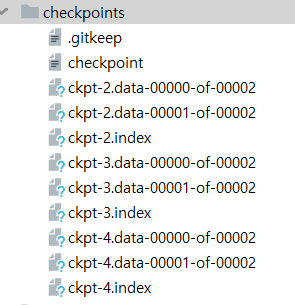
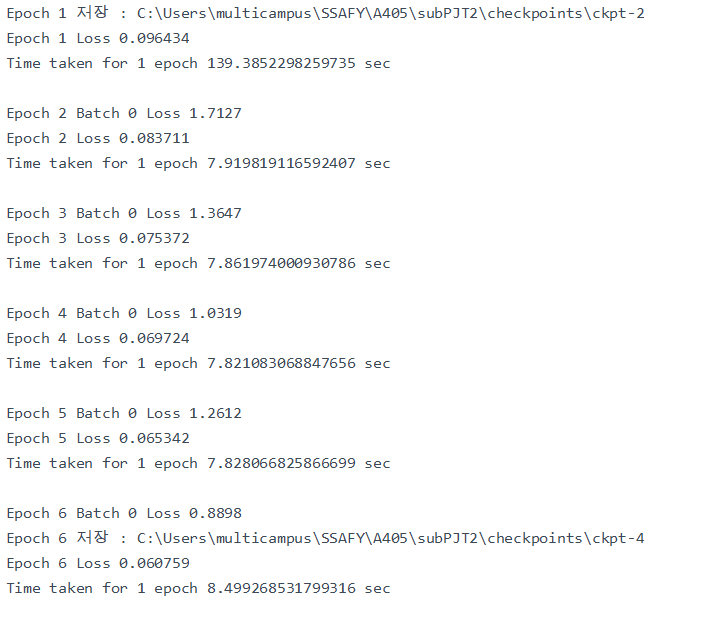
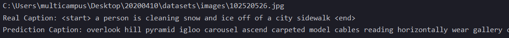
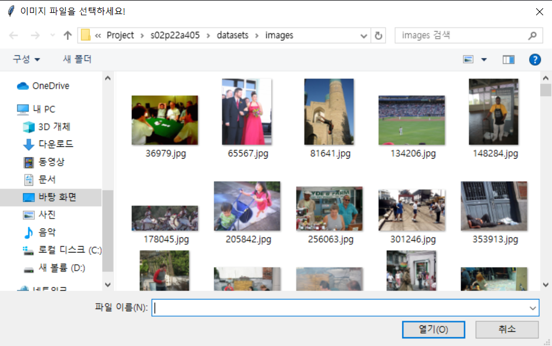
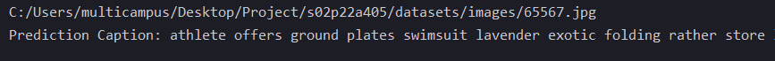

# 🤞🥰 이미지 캡셔닝 기능 구현

  

> 인공지능 프로젝트 "이미지 캡셔닝 활용 시스템" Sub PJT 2


## 🛒 Table of Contents

- [Installation](#installation)
- [Quick Start](#Quick Start)
- [Features](#features)
- [Documentation](#Documentation)
- [Team](#Team)


## 🏃 Installation 

### Clone

- 다음 링크를 통해 리포를 클론합니다.  
- HTTPS `https://lab.ssafy.com/s02-ai-sub2/s02p22a405.git`

### Setup

- 이미지 파일을 [다운로드](https://i02lab1.p.ssafy.io/) 하고 `datasets/` 에 위치시킵니다.

- 가상환경을 설정해줍니다. 프로젝트는 패키지 관리 및 가상환경 설정을 위해 Anaconda 를 사용합니다.

  ```bash
  conda env create -f AI.yaml
  ```

  - 또는 다음 [파일](.\doc\spec-file.txt)을 참고하여 프로젝트에서 사용 된 프로그램을 확인, 설치할 수 있습니다. 

  - 기본적인 프로젝트 환경

    | 분류     | 기술 스택/도구 | 버전     |
    | -------- | -------------- | -------- |
    | 언어     | Python         | 3.7.6    |
    | 머신러닝 | Numpy          | 1.18.1   |
    |          | Scipy          | 1.4.1    |
    |          | Scikit-learn   | 0.22.1   |
    | 딥러닝   | Tensorflow     | 2.0.0    |
    |          | Keras          | 2.2.4-tf |
    | 시각화   | Matplotlib     | 3.1.3    |
    |          | Pillow         | 7.0.0    |
    | 기타     | Anaconda       | 4.8.2    |

- 컴퓨터의 환경에 따라 config 를 통해 batch, epoch 사이즈를 조정할 수 있습니다. 

- 또는 GPU 환경을 아래 코드를 통해 조정하면 더 원활하게 프로그램을 실행시킬 수 있습니다.

  ```python
  # train.py
  
  from tensorflow.compat.v1 import ConfigProto
  from tensorflow.compat.v1 import InteractiveSession
  
  config = ConfigProto()
  
  # 방법 1
  config.gpu_options.per_process_gpu_memory_fraction = 0.4
  # 방법 2
  config.gpu_options.allow_growth = True
  
  session = InteractiveSession(config=config)
  ```

  


## 🚀 Quick Start

- 주어진 데이터셋을 전처리하고 모델을 학습시킵니다.

  ```bash
  $python train.py
  ```

  - 포함한 `preprocess.py` 의 전처리 함수들을 실행합니다.
    - `train_datasets` & `test_datasets` 를 불러오거나, 저장하여 불러옵니다.
    - `tokernizer` 를 불러옵니다. 
  - 모델 학습을 수행하며 손실을 출력합니다.


- 학습시킨 모델을 검증하고 테스트 합니다.

  ```bash
  $python predict.py
  ```

  - 테스트 데이터에서 임의의 이미지를 뽑아 캡션을 생성합니다.
  - 이미지와 캡션을 시각화하고 실제 캡션을 함께 출력하여 비교할 수 있게 합니다.


- 사용자가 임의의 사진을 업로드 하면 학습된 모델을 통해 캡션을 생성 합니다.

  ```bash
  $python demo.py
  ```

- 이미지 증강이 어떤 식으로 이루어지는지 보여줍니다.

  ```bash
  $python doc/img_augmentation_test.py
  ```

- 정규화한 이미지를 보여줍니다.

  ```bash
  $python doc/image_normalization_test.py
  ```

  - 이미지를 어떤 값으로 정규화 할 것인지 결정하기 위해 총 다섯가지의 방법을 사용하여 정규화한 이미지를 모두 띄워줍니다. 이를 각각 비교하고 어떠한 값을 활용할 지 결정할 수 있습니다.

    1. 오리지널 
    2. 넘파이로 min-max  값을 가져옵니다.
    3. 넘파이로 mean-std  값을 가져옵니다.
    4. 텐서플로우로 mean-var 값을 가져옵니다.
    5. 텐서플로우에서 정규화시켜주는 방법

- 텍스트 데이터 전처리

  ```bash
  $python doc/tokenizer_sample.py
  ```

  - datasets/ 아래에 tokenizer_sample.pkl 파일이 저장됩니다.
  - 저장 된 tokenizer 를 불러와 주어진 caption 을 토큰화 하고, sample 로 두 개 출력합니다.


## ⚡ Features

### 1. 프로젝트 구조

```
├─checkpoints
├─data
│  ├─ feature_extraction.py
│  ├─ img_augmentation.py
│  └─ preprocess.py
├─datasets
│  ├─ images
│  ├─ features
│  ├─ captions.py
│  ├─ config.csv
│  ├─ tokernizer.pkl
│  ├─ train_datasets.npy
│  └─ test_datasets.npy
├─doc
│  ├─images
│  ├─meeting
│  ├─ 솔지
│  ├─ 수민
│  ├─ 수진
│  ├─ 찬우
│  └─ 현동
├─models
│  ├─ decoder.py
│  └─ encoder.py
├─utils
│  └─ utils.py
├─ config.py
├─ train.py
└─ predict.py
```

- train.py, predict.py 를 실행시킬 때 config 를 통해 batch, epoch 등의 변수를 조정할 수 있습니다. 자세한 설명은 아래 코드를 입력하시면 확인하실 수 있습니다. 또한 이 변수들은 파일을 실행시켰을 때 datastes/config.csv 에 저장됩니다.

```bash
$ python train.py -h
```


### 2. 데이터 전처리

#### 데이터셋 분리 및 저장

- `train.py` 에서 preprocess.py의  `dataset_split_save ` 함수를 호출하여`train_datasets` 과 `test_datasets` 파일의 생성 여부를 확인합니다. 아직 데이터셋이 없다면 전체 데이터셋을 분리, 저장합니다.

  ``````python
  # preprocess.py
  
  def dataset_split_save(base_dir, caption_file_path, test_size):
      train_datasets_path = os.path.join(base_dir, 'train_datasets.npy')
      test_datasets_path = os.path.join(base_dir, 'test_datasets.npy')
      if not os.path.exists(train_datasets_path):
          dataset = get_path_caption(caption_file_path)
          train_dataset, val_dataset = train_test_split(dataset,
                                                        test_size=test_size,
                                                        shuffle=False)
          np.save(train_datasets_path, train_dataset)
          np.save(test_datasets_path, val_dataset)
          print('dataset 을 train_datasets 과 test_datasets 으로 나눕니다.')
      else:
          print('저장 된 train_datasets 과 test_datasets 을 사용합니다.')
  ``````

- `test-size` 값을 config 로 설정하여 train-test 비율을 지정할 수 있습니다. 

#### 데이터 파일 로드

- `config` 설정으로 train/test 중 어느 데이터셋을 가져올지 지정합니다.

  샘플링 여부를 설정합니다.

- 텍스트 데이터는 `<start>` `<end>` 토큰을 추가하여 반환합니다.

#### 텍스트 토큰화

- `tokenizer.pkl`이 없다면 tokenizer 를 생성, 저장합니다.

  ```python
  def get_tokenizer(tokenizer_path, caption_file_path, num_words):
      if not os.path.exists(tokenizer_path):
          dataset = get_path_caption(caption_file_path)
          captions = dataset[:, 2:]
  
          captions = np.squeeze(captions, axis=1)
          captions = ['<start>' + cap + ' <end>' for cap in captions]
  
          tokenizer = tf.keras.preprocessing.text.Tokenizer(num_words=num_words + 1,
                                                            oov_token='<unk>',
                                                            lower=True,
                                                            split=' ',
                                                            filters='!"#$%&()*+.,-/:;=?@[\]^_`{|}~ ')
  
          tokenizer.fit_on_texts(captions)
          tokenizer.word_index['<pad>'] = 0
          tokenizer.index_word[0] = '<pad>'
  
          with open(tokenizer_path, 'wb') as f:
              pickle.dump(tokenizer, f, protocol=pickle.HIGHEST_PROTOCOL)
      else:
          with open(tokenizer_path, 'rb') as f:
              tokenizer = pickle.load(f)
  
      return tokenizer
  ```

- 저장 된 Tokenizer 를 불러와 주어진 텍스트를 벡터로 변경, 각 캡션의 길이를 맞춰줍니다.

  ```python
  def change_text_to_token(tokenizer_path, train_captions):
      with open(tokenizer_path, 'rb') as f:
          tokenizer = pickle.load(f)
      train_seqs = tokenizer.texts_to_sequences(train_captions)
      max_length = max(len(t) for t in train_seqs)
      cap_vector = tf.keras.preprocessing.sequence.pad_sequences(train_seqs, padding='post')
      return cap_vector, max_length
  ```

#### 이미지 정규화

- 이미지를 불러올 때 함께 수행합니다.

  ``````python
  def load_image(image_path):
      img = tf.io.read_file(image_path)
      img = tf.image.decode_jpeg(img, channels=3)
      img = tf.image.resize(img, (299, 299))
      img = tf.keras.applications.inception_v3.preprocess_input(img)
      return img, image_path
  ``````

  InceptionV3 모델을 사용하기 위해, 해당 모델에 적합한 형태로 전처리 하는 과정을 추가하여 이미지를 반환합니다.

#### 이미지 증강

- 파이썬 라이브러리 `imgaug`를 사용하여 Image Augmentation(이하 이미지 증강) 을 수행합니다.

  ```python
  from imgaug import augmenters as iaa
  # imgaug 모듈을 불러옵니다
  ```

  Sequentianl 안에서 여러 종류의 이미지 증강을 수행합니다. 

  BlendAlpha 로 알파블렌딩 작업을 추가해 이미지를 증강할 수 있습니다.

- 이미지 증강 작업은 `feature_extraction.py` 에서 호출합니다.

#### 특징 추출

- `feature_extraction()` 안에서 이미지 증강 실행 여부를 판별하고, 수행합니다. 증강된 이미지는 데이터셋 폴더에 저장됩니다. 증강한 이미지들에서 특징값을 추출할 때는 사전학습된 InceptionV3 모델을 사용합니다. `preprocess` 의 `load_image` 부분에서 전처리 과정을 수행해 이미지를 불러옵니다. 이때 InceptionV3의 학습에 주로 이용된 형식으로 매치시킵니다. `num_parallel_calls=tf.data.experimental.AUTOTUNE` 는 병렬데이터셋을 불러오고, 파일을 여는 데 기다리는 시간을 단축합니다.

- 속도상(bottleneck)의 문제로 모델링은 최초 1번만 수행합니다. 

  ```python
  image_model = tf.keras.applications.InceptionV3(include_top=False,weights='imagenet')
  new_input = image_model.input
  hidden_layer = image_model.layers[-1].output
  image_features_extract_model = tf.keras.Model(new_input, hidden_layer)
  ```


### 3. 실행

#### 모델 학습

-  RNN, CNN 구현 코드는 크게는 TensorFlow 공식 문서 [Image captioning with visual attention](https://www.tensorflow.org/tutorials/text/image_captioning) 자료를 참고하고 있습니다. 이 자료에서 Attention 과 관련한 부분은 [Show, Attend and Tell: Neural Image Caption Generation with Visual Attention](https://arxiv.org/abs/1502.03044) 를 참고합니다.


#### train_step

- `GradientTape` 는 자동 미분(주어진 입력 변수에 대한 연산의 그래디언트gradient 를 계산)하는  텐서플로우 API 입니다. ([텐서플로우 공식문서](https://www.tensorflow.org/tutorials/customization/autodiff#그레디언트_테이프)) 그레디언트 테이프 컨텍스트 안에서 계산을 수행합니다.

  ```python
  with tf.GradientTape() as tape:
  	...
  ```

#### checkpoint

- 일정 지점마다 모델 변수를 저장하는 checkpoint manager 를 생성합니다.

- 저장된 체크포인트가 있다면, 가장 최신 체크포인트의를 불러와 모델 학습을 시작합니다.



#### Optimizer & Loss function

- optimizer 는 `Adam` 을, 손실 함수는 integer 인코딩이므로 `Sparse Categorical Cross Entropy` 를 사용합니다.


### 4. 결과물

- `train.py` 실행시 아래처럼 출력됩니다.



- `predict.py` 실행시 아래와 같은 결과물을 확인할 수 있습니다.

  - 출력 결과

    

- `demo.py` 실행 시 아래와 같은 결과물을 확인할 수 있습니다.

  - 사진 선택

    

  - 출력 결과

    


## 🕵 Documentation

### 프로젝트 관리

- [프로젝트 관리](./doc/dev_notice.md)


### 멋진💪 팀원들이 정리한 멋진💪 자료들

- 솔지, [데이터 정규화와  CNN](./doc/솔지/프로젝트 개념 정리.md)
- 솔지, [손실함수와 옵티마이저, 체크포인트](./doc/솔지/모델 학습을 위한 개념 정리.md)
- 솔지, [numpy 배열 다루기](./doc/솔지/이미지 정규화, 배열.md)
- 수민, [프로젝트 기본 개념과 이미지 캡셔닝 프로젝트 아키텍처](./doc/수민/README.md)
- 수민, [워드 임베딩과 RNN, Attention](./doc/수민/study_req5.md)
- 찬우, [퍼셉트론 Perceptron](./doc/찬우/퍼셉트론 Perceptron.md)
- 찬우, [머신러닝 기본 개념](./doc/찬우/머신러닝 기본개념.md)
- 찬우, [CNN](./doc/찬우/CNN.md)
- 수진, [데이터 전처리 - 이미지 특성 추출](./doc/수진/docs/이미지_특징_추출(feature_extraction.md))
- 수진, [학습 모델](./doc/수진/docs/학습(train).md)
- 수진, [Linear_Regression](./doc/수진/docs/선형_회귀(Linear_Regression).md)
- 현동, [Tokenizer](./doc/현동/Tokenizer.md)


## 💖 Team

> SSAFY 2기 4반 5팀 : 김수민, 양찬우, 이수진, 조현동, 최솔지 

**	너는**  


------

여러분이 사랑하는 자존감이 낮은 친구에게 [이 영상](https://youtu.be/d4XGFYNcUEc)을 보여주세요. 💕