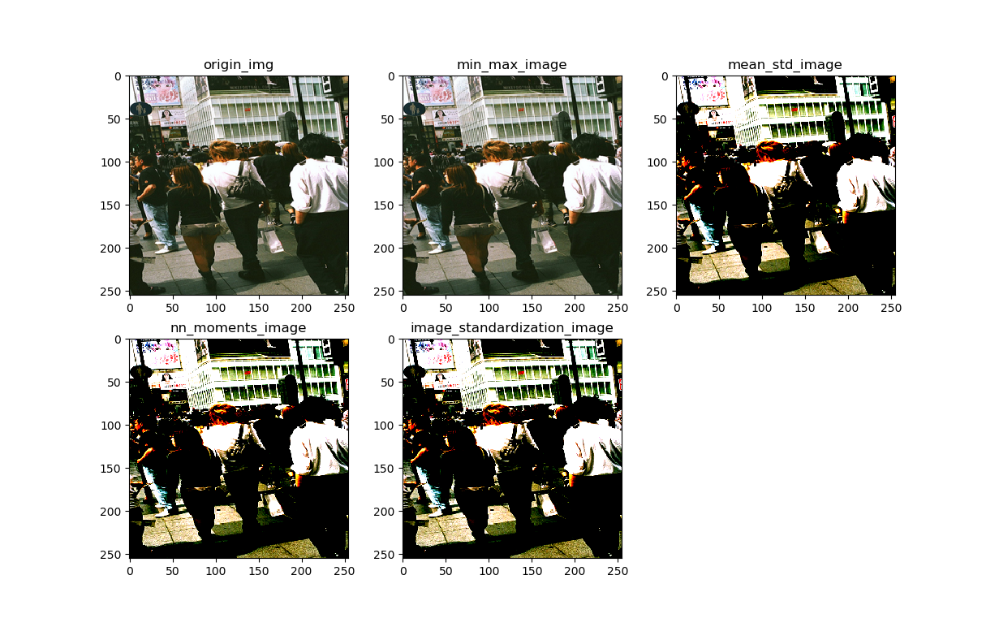

# image_normalization_test

 이미지 로드 함수와 시각화를 한번에 처리해서 정규화 결과를 확인한다.


`get_data_file()`

subPJT1 에서 작성한 코드로 만든 트레이닝 데이터 세트를 가져온다.


`image_load()`

이미지 파일 경로에서 해당 이미지 파일을 tensorflow 로 읽어온다.

이미지를 읽어오면서 크기를 조정한다. (255 픽셀은 임의의 크기이다.)

팀장이 테스트용으로 작성한 코드를 가져왔다.


`img_normalization_1()`

pillow 로 이미지를 가져온다.

numpy 로 R, G, B 채널당 평균과 표준편차를 계산하여 정규화한다.

다른 팀원이 작성한 코드를 비교를 위해 가져왔다.


`img_normalization_2()`

tensorflow 함수를 이용해 평균과 분산을 구하는 것이 하나,

다른 하나는 tf.image.per_image_standardization() 으로 바로 정규화하는 방법을 사용했다.


```
$ python image_normalization_test.py
```

정규화된 이미지를 리스트로 받아 출력하여 확인한다.



