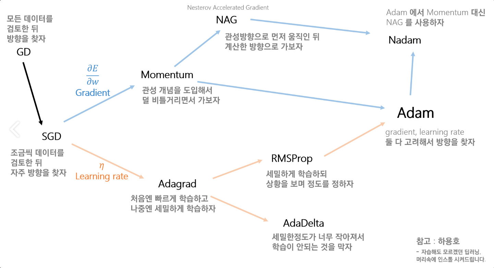

# 모델 학습을 위한 개념 정리

## 손실함수Loss Function

### Cost(=Loss) function

구하는 가설과 실제 데이터와의 차이(잔차) ⇒ 머신러닝에서 Cost

$$(H(x) - y)^2$$

차이가 클 때는 Penalty(벌점)을 더 주고, 차이가 작으면 패널티를 상대적으로 덜 주기 때문에 비용을 계산하기에 효과적이다.

$$cost = \frac{1}{m}\sum_{i=1}^{m}(H(x^i) - y^i)^2$$

m : 트레이닝 데이터의 개수
i: 임의의 트레이닝 데이터 인덱스
H(x): x에서의 가설 상 예측 값
y: x에서의 실제 값

우리가 세운 가설과 실제 데이터가 얼마나 맞는지 확인한다.

W 와 b 의 값에 따라 cost 가 달라진다. 즉, Cost Function 은 W 와 b 에 대한 식이다.

### 어떻게 하면 Cost 를 최소화 할 수 있을까?

- Hypothesis and cost

$$H(x) = Wx + b$$

$$cost(W, b) = \frac{1}{m}\sum_{i=1}^{m}(H(x^i)-y^i)^2$$

- Simplified hypothesis

    $$H(x) = W(x)$$

    $$cost(W) = \frac{1}{m}\sum_{i=1}^{m}(W(x^i)-y^i)^2$$

W 를 계속 바꾸면서 Try & Error 과정을 거쳐 최소 Cost 를 선택한다.

텐서플로에서 모듈을 제공한다.

    tf.keras.losses.MeanSquareError
    tf.keras.losses.CrossEntropyError

- 모델 컴파일에 사용 예시

        model.compile(optimizer='adam',
                      loss=tf.keras.losses.BinaryCrossentropy(from_logits=True),
                      metrics=['accuracy'])

#### 평균 제곱 오차(MSE, Mean Squared Error)

가장 많이 쓰이는 손실함수이다. 회귀에서 주로 사용한다.

```python
def MSE(y,t):
    return (1/2)* np.sum((y-t)**2)
```

#### 교차 엔트로피 오차(CEE, Cross Entropy Error)

 원-핫 인코딩(one-hot encoding)했을 경우에만 사용할 수 있는 오차 계산법이다. 분류에서 주로 사용한다.

```python
def cross_entrpy_error(y,t): 
		delta = 1e-7 
		return -np.sum(t*np.log(y+delta))
```

 시그모이드sigmoid 함수를 사용하면 자연상수 e 가 포함되므로 평균 제곱 오차를 사용했을 때 지역 최소점에 빠질 가능성이 커진다. 이것을 방지하기 위해 교차 엔트로피 오차를 사용할 수 있다.

##### 원-핫 인코딩(One-hot encoding)

벡터 표현 방식의 일종. 단 하나의 값만 Hot(True) 이고 나머지는 모두 Cold(False) 인 인코딩. 

 우리 코드에서는 -원-핫 인코딩이 아니라`tf.keras.losses.SparseCategoriaclCrossentropy()` 를 사용한다.

- `tf.keras.losses.CategoricalCrossentropy()` 에서 `from_logits` 는 모델의 출력값이 문제에 맞게 정규화되었는지 여부이다. 모델 출력값이 sigmoid 같은 활성화 함수를 거쳤다면 `logit=True` 가 된다.\

    우리 코드에서는 ReLU 함수로 입력을 변환하고 있으므로 True 로 처리한다.

### 손실 함수의 목적

 머신러닝 모델의 최종 목적은 높은 정확도를 이끌어내는 매개변수(w, b) 를 찾는 것이다. 손실함수의 값을 가능한 적게 하는 매개변수의 값을 찾고, 매개변수의 미분을 계산하고, 값을 갱신하는 과정을 반복한다. 

 손실 함수는 매개변수의 변화에 따라 연속적으로 변화한다. 반면 정확도는 매개변수의 변화에 둔감하고, 변화가 있어도 불연속적으로 변화하므로 최적화하기 힘들다.

```python
# train.py

loss_object = tf.keras.losses.SparseCategoricalCrossentropy(
    from_logits=True, reduction='none')
```

[https://everyday-deeplearning.tistory.com/entry/파이썬으로-딥러닝하기-손실함수-평균제곱오차MSE-교차-엔트로피-오차CEE](https://everyday-deeplearning.tistory.com/entry/%ED%8C%8C%EC%9D%B4%EC%8D%AC%EC%9C%BC%EB%A1%9C-%EB%94%A5%EB%9F%AC%EB%8B%9D%ED%95%98%EA%B8%B0-%EC%86%90%EC%8B%A4%ED%95%A8%EC%88%98-%ED%8F%89%EA%B7%A0%EC%A0%9C%EA%B3%B1%EC%98%A4%EC%B0%A8MSE-%EA%B5%90%EC%B0%A8-%EC%97%94%ED%8A%B8%EB%A1%9C%ED%94%BC-%EC%98%A4%EC%B0%A8CEE)

[https://kolikim.tistory.com/36](https://kolikim.tistory.com/36)

[https://hwiyong.tistory.com/335?category=842725](https://hwiyong.tistory.com/335?category=842725)


## Optimizer

딥러닝에서 Optimization 은 학습 속도를 빠르고 안정적이게 하는 것을 의미한다.

loss function 의 기울기를 구해 loss 를 줄이는 방식으로 뉴럴 네트워크가 동작하는데, 기존의 Gradient Descent 방식은 시간이 오래걸린다는 문제가 있어 다른 Optimizer 들이 개발, 발전됐다.

 SGD(Stochastic Gradient Descent) 는 데이터를 Mini batch 만큼 빠르게 보고 최적의 값을 찾아간다. 과정 자체는 돌아가는 것처럼 보이지만 훨씬 빠른 속도를 보인다. 그러나 설정이 뒤죽박죽이고, 스텝 사이즈==learning rate 에 따라 오래걸리거나 최적값을 찾지 못할 수도 있는 문제가 생긴다.



 옵티마이저 발전 과정은 Gradient 를 수정할 것이냐,  Learning Rate 를 수정할 것이냐로 나뉜다. 방향도 스텝사이즈도 고려하는 Optimization 방식이 Adam 이고, 최근에 가장 많이 사용된다.

```python
# train.py

optimizer = tf.keras.optimizers.Adam()
```

[https://gomguard.tistory.com/187](https://gomguard.tistory.com/187)

[https://seamless.tistory.com/38](https://seamless.tistory.com/38)


## Checkpoint

Checkpoint 는 모델이 사용한 매개변수를 저장해둔다. 이후 저장된 매개변수 값을 사용할 때 유용하다. 

텐서플로에서는 `tf.train.Chekpoint` 객체로 만들 수 있다.

```python
checkpoint_path = os.path.join(config.base_dir, 'checkpoints')
ckpt = tf.train.Checkpoint(encoder=encoder,
                           decoder=decoder,
                           optimizer = optimizer)
ckpt_manager = tf.train.CheckpointManager(ckpt, checkpoint_path, max_to_keep=3)
```

체크포인트를 생성하고, 저장할 변수들을 넣는다.

`CheckpointManager` 로 편리하게 관리할 수 있다.

`ckpt_manager.save()` 로 저장한다.

`max-keep` 은 몇개까지 유지할지를 설정한다.

```python
print(manager.checkpoints)
```

유지되고 있는 chcekpoint 를 확인할 수 있다.

```python
ckpt.restore(ckpt_manager.latest_checkpoint)
```

저장된 변수값을 불러온다.