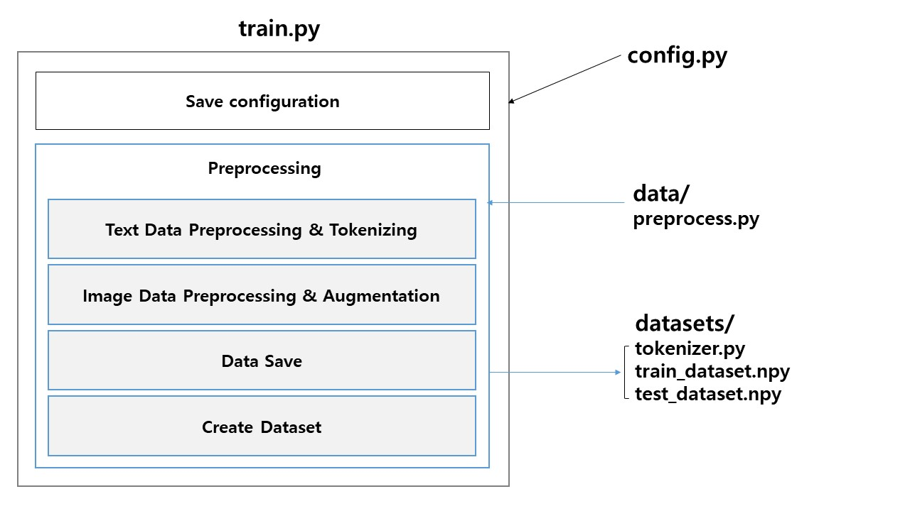

# Sub PJT II (Week 2, 3) 이미지 캡셔닝 활용 시스템

이미지 캡셔닝 구현

## 1. 프로젝트 개요

### Task

이미지 담당 / 텍스트 담당 - 이미지 캡셔닝 모델 구현

이미지 캡셔닝이란? 이미지를 묘사하는 문장을 생성하는 것

1. 이미지가 입력으로 들어온다

2. 이미지 모델로 특성 뽑는다

3. 텍스트 모델에 전달한다

4. 이미지를 묘사하는 텍스트를 생성한다

### Content

- CNN - 이미지 데이터에 적합한 Convolution 신경망
  - 이미지에서 물체의 형태를 인지하거나 색깔을 구별하는 등 "특성"을 뽑아내는 데 사용된다
- RNN - 순서가 있는 데이터에 적합한 순환 신경망
  - 뽑아낸 특성을 바탕으로 문장을 생성한다
- 이 두 모델을 합쳐 Image Captioning 모델을 구현한다.

## 2. 프로젝트 목표

1. 컨볼루션 인공 신경망(CNN) 이해

2. 순환 신경망(RNN) 이해

3. 이미지 캡셔닝 모델 이해

4. 데이터셋 분할과 성능 최적화 이해

5. 팀별 서비스 기획, 데이터셋 검색 및 모델 선정

## 3. 필수 지식 학습

### 이미지 처리

#### CNN

##### [기본 연산들](https://excelsior-cjh.tistory.com/180)

- 컨볼루션 신경망이 사용되는 다양한 연산들에 대한 설명

##### [강의 및 텐서훌로우 예시 코드](https://www.youtube.com/watch?v=9fldE3-yJpg&list=PLQ28Nx3M4Jrguyuwg4xe9d9t2XE639e5C&index=34)

- 컨볼루션 연산에 대한 설명과 이를 텐서훌로우로 구현하는 방법

##### [강의 및 화이토치 예시 코드](https://www.youtube.com/watch?v=rySyghVxo6U&list=PLQ28Nx3M4JrhkqBVIXg-i5_CVVoS1UzAv&index=19)

- 컨볼루션 연산에 대한 설명과 이를 파이토치로 구현하는 방법

#### CNN 모델

##### [주요 모델들](https://github.com/GunhoChoi/PyTorch-FastCampus/blob/master/04_CNN_Advanced/CNN_Advanced.pdf)

- 이미지넷 대회에 나온 다양한 모델들

##### [이미지넷 챌린지 및 발전 과정](https://github.com/GunhoChoi/PyTorch-FastCampus/blob/master/04_CNN_Advanced/CNN_Advanced.pdf)

- 이미지넷 대회에 나온 모델들이 발전해온 과정

##### [DenseNet](https://www.youtube.com/watch?v=fe2Vn0mwALI)

- 덴스넷 모델에 대한 설명

### 자연어 처리

#### NLP

##### [토큰화](https://wikidocs.net/21698)

- **말뭉치 또는 코퍼스(corpus)**

  - 자연 언어 연구를 위해 특정한 목적을 가지고 언어의 표본을 추출한 집합 / 조사나 연구 목적에 의해서 특정 도메인으로부터 수집된 텍스트 집합

  - 코퍼스 데이터를 토큰화(tokenization) & 정제(cleaning) & 정규화(normalization)

- **토큰화(tokenization)**

  - 토큰(token)이라 불리는 단위로 나누는 작업을

  - 갖고 있는 코퍼스가 정제되지 않은 상태라면, 코퍼스는 문장 단위로 구분되어있지 않을 가능성이 큼

  - 이를 사용하고자 하는 용도에 맞게 하기 위해서는 문장 토큰화가 필요할 수 있음

- **품사 태깅(part-of-speech tagging)**

  - 단어 토큰화 과정에서 각 단어가 어떤 품사로 쓰였는지를 구분해놓는 것

##### [정수 인코딩](https://wikidocs.net/31766)

- 케라스의 텍스트 전처리

- 각 단어를 고유한 정수에 맵핑

- 보통 단어에 대한 빈도수 기준으로 정렬한 뒤 부여

- 단어를 빈도수 순으로 정렬한 vocabulary 만들고

- 빈도수가 높은 순서대로 낮은 숫자부터 정수를 부여하는 방법

##### 원 핫 인코딩

- 단어 집합: 텍스트의 모든 단어의 중복을 허용하지 않고 모아 놓음

- 단어 집합의 크기를 벡터의 차원으로 하고, 표현하고 싶은 단어의 인덱스에 1의 값을 부여하고, 다른 인덱스에는 0을 부여하는 단어의 벡터 표현 방식

##### [임베딩](https://subinium.github.io/Keras-6-1/)

- 정수 인코딩 된 벡터를 임베딩하는 방법

#### RNN

##### [순환 신경망 기초](https://excelsior-cjh.tistory.com/183?category=940400)

- 순환 신경망에 대한 기본적인 설명과 예시 코드

##### [LSTM & GRU](https://datascienceschool.net/view-notebook/770f59f6f7cc40c8b6dc98dddd06c6c5/)

기본 RNN 을 개선한 LSTM 과 GRU 에 대한 설명

### 이미지 캡셔닝 프로젝트 아키텍처

#### 1. 기본 아키텍처

1. 이미지를 입력으로 받아 CNN 모델을 통해 이미지의 특징을 추출한다.

2. 추출한 특징은 RNN 모델로 전달된다.

3. RNN 모델은 여기에 추가로 토큰화된 캡션 데이터 일부를 입력받는다.

   (RNN 모델은 CNN모델을 통해 추출한 이미지의 특성과 캡션 벡터 2가지를 입력으로 받아 학습한다)

#### 2. 프로젝트 구조

##### 1) 전처리 과정 (= Req 1 ~ Req 2)

- 전처리 후 train 혹은 test 용 데이터셋을 저장함

- tokenize 에 사용한 tokenizer 객체를 pickle 에 저장

###### 한 번만 시행해도 되는 전처리

- 캡션 데이터를 토큰화한다.

  - csv 파일을 토대로 실제 이미지 경로와 "이미지에 해당하는 토큰화된 캡션"을 묶는다.

- 전체 데이터셋을 분할한다. (모델에 입력으로 전달할 때 유용하도록)

  - 학습용, 테스트용 데이터로 분할해서 저장해 놓는다. (`train_dataset.npy`, `test_dataset.npy`)

- 어떤 단어가 토큰에 해당하는지 맵핑된 정보를 기록해놓은 토크나이저 또한 저장한다. (`tokenizer.pkl`)

- pre-trained model 을 이용해 미리 이미지의 특성을 뽑을 수도 있다.

###### 매번 진행하는 전처리

- train / test 여부에 따라 (이미지 경로와 토큰화된 캡션 담긴) 데이터셋를 불러오고

  - `train_dataset.npy`, `test_dataset.npy`

- 토크나이저도 불러온다.

  - `tokenizer.pkl`

- 데이터셋(`.npy`)에는 1. 이미지 경로와 2. 토큰화된 캡션 있음

  - 1'. 실제 이미지 데이터와 2. 토큰화된 캡션을 바인딩해서 텐서플로우 데이터셋(`tf.data.dataset`)으로 만든다.

  - 텐서플로우 데이터셋을 만드는 과정에서 데이터 랜덤성을 추가하기 위해 데이터의 순서를 바꾸기도 하고, 이미지 데이터의 경우 Augmentation 을 많이 사용한다.

    - 단, test 일 경우 데이터 순서 바꾸기, 이미지 Augmentation이 들어가지 않게 구현한다.

##### 2) 학습 과정

- 전처리 과정을 통해 `tf.data.Dataset` 을 전달받는다.

- `tf.data.Dataset` 에는 Encoder 의 입력이 되는 1. 이미지 데이터 또는 2. 미리 뽑힌 특성 벡터가 들어 있다. 토큰화된 캡션도 쌍으로 들어 있다.

- `1.`이미지 데이터 또는 2. 미리 뽑힌 특성 벡터는 Encoder 에 들어가 Decoder 의 입력 형식에 맞게 변환되어 나온다.

- Encoder 의 결과값은 Decoder 로 전달된다. 이와 동시에 `<start>` 토큰의 인덱스가 Decoder 로 전달된다.

- Decoder 는 순차적으로 이미지를 묘사하는 문장의 단어들을 생성한다.

  - 이때 단어들은 토큰의 가지 수만큼 길이를 가지는 벡터로 나온다.

- 이 결과값을 정답 캡션(그림7의 Tokenized Caption) 과 비교해 손실을 계산한다.

- 이 손실을 기반으로 모델의 변수들을 학습하여 최적화를 진행한다.

##### 3) 테스트 과정

- 모델이 학습되고 나면 체크포인트 매니저를 이용해 학습된 Encoder와 Decoder의 변수들을 불러와 테스트 이미지에 대한 예측 캡션을 생성할 수 있다.

- 이미지 데이터가 전달되어 캡션이 생성되는 과정까지는 학습과 동일하지만 결과 문장을 사람이 해석할 수 있게 바꿔주는 과정이 추가로 진행된다.

### 모두를 위한 딥러닝 입문 시즌2 - Tensorflow

[Youtube](https://www.youtube.com/playlist?list=PLQ28Nx3M4Jrguyuwg4xe9d9t2XE639e5C)

[Github](https://deeplearningzerotoall.github.io/season2/lec_tensorflow.html)

#### PART 2: Basic Deep Learning

##### Lec 08-1: 딥러닝의 기본 개념: 시작과 XOR 문제

- 활성화 함수(Activation function)

- XOR 문제

  - XOR 을 Linearly 분리 불가능

- 퍼셉트론(Perceptrons)

##### Lec 08-2: 딥러닝의 기본 개념2: Back-propagation 과 2006/2007 '딥'의 출현

- 오차 역전파(Backpropagation)

- 가중치 초기화(Weight initialization)

- CIFAR, ImageNet

##### Lec 09-1: XOR 문제 딥러닝으로 풀기

#### PART 4: Recurrent Neural Network

Lec 12: NN의 꽃 RNN 이야기

Lab 12-0: rnn basics

Lab 12-1: many to one (word sentiment classification)

Lab 12-2: many to one stacked (sentence classification, stacked)

Lab 12-3: many to many (simple pos-tagger training)
