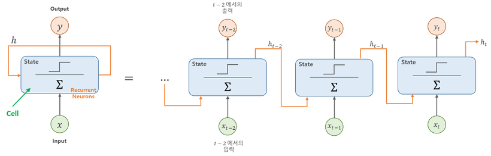
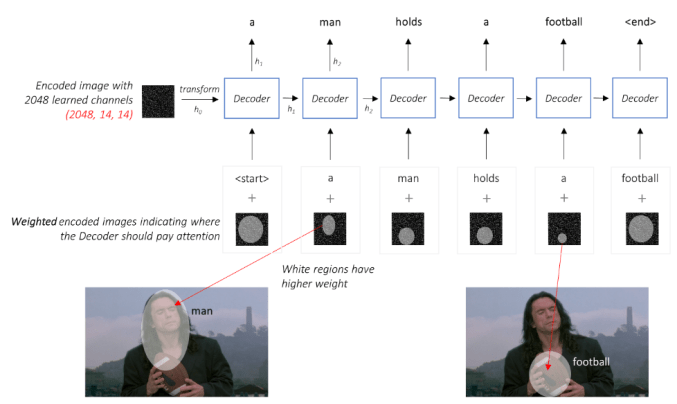

# Req5. 텍스트 모델(Decoder)

```bash
기능 명세

필수 지식 학습
```

## 기능 명세

### Req5. 텍스트 모델(Decoder) 구현

#### Req5-1 임베딩 레이어 구현

- 토큰화된 벡터를 지정한 크기의 공간에 투영하는 임베딩 함수를 구현한다.

- 이때 `tf.keras.layers.Embedding` 클래스를 사용하여 구현한다.

#### Req5-2 RNN 모델 구현

- 임베딩된 벡터를 입력으로 받는 RNN 모델을 구현한다.

- `tf.keras.layers.GRU` `tf.keras.layers.LSTM`, `tf.keras.layers.RNN`를 참고하여 구현한다.

#### Req5-3 역 임베딩 레이어 구현

- RNN 모델에서 나온 결과값을 토큰화된 정답 데이터와 비교할 수 있도록 차원을 맞춰주는 역 임베딩 레이어를 구현한다

- `tf.keras.layers.Dense` 를 이용해 구현한다.

## 필수 지식 학습

### [워드 임베딩(Word Embedding)](https://wikidocs.net/33520)

- 워드 임베딩: 단어를 밀집 표현으로 변환하는 방법

- 밀집 표현/밀집 벡터/임베딩 벡터

  - (희소 표현과 달리) 벡터의 차원을 단어 집합의 크기로 상정하지 않는다.

  - 사용자가 설정한 값으로 모든 단어의 벡터 표현의 차원을 맞춘다.

  - 초기에는 랜덤값을 가지지만, 인공 신경망의 가중치가 학습되는 방법과 같은 방식으로 값이 학습되고 변경된다.

- 케라스에서 제공하는 도구인 `Embedding()`

  1. 단어를 랜덤한 값을 가지는 밀집 벡터로 변환한 뒤에,

  2. 인공 신경망의 가중치를 학습하는 것과 같은 방식으로 단어 벡터를 학습하는 방법을 사용한다.

  - 단어를 밀집 벡터로 만든다.

  - 즉, **정수 인코딩된 단어**를 입력으로 받아 임베딩 층을 만든다.

  - `Embedding()` 입력 인자와 2D 정수 텐서 다른건가??</u>

  - 첫번째 인자 = 단어 집합의 크기. 즉, 총 단어의 개수

  - 두번째 인자 = 임베딩 벡터의 출력 차원. 결과로서 나오는 임베딩 벡터의 크기

  - input_length = 입력 시퀀스의 길이

  - Input: 2D Tensor

    - (number of samples, input_length)

      - (단, sample 은 정수 인코딩된 결과로 정수의 시퀀스임)

  - Output(Return): 3D Tensor

    - (number of samples, input_length, embedding word dimentionality)

### [RNN](https://excelsior-cjh.tistory.com/183?category=940400)

- 메모리 셀(memory cell) 또는 셀(cell): 타임 스텝에 걸쳐 특정 상태를 보존하는 신경망의 구성 요소
- 타임 스텝 $t$ 에서 셀의 상태 $h_t$ 는 (h = hidden 의미) 타임 스텝 $t$ 에서의 입력과 이전 타임 스텝의 상태에 대한 함수이다.

$$
h_t = f({h}_{t-1}, x_t)
$$



### keras 주의할 점

#### 케라스에서의 텐서

- 앞서 Numpy로 각 텐서의 ndim(차원)과 shape(크기)를 출력할 수 있다.

- 케라스에서는 입력의 크기(shape)를 인자로 줄 때 input_shape라는 인자를 사용한다.

- 여기서 input_shape는 배치 크기를 제외하고 차원을 지정하는데,

  - input_shape(6, 5)라는 인자값을 사용하고 배치 크기를 32라고 지정한다면 이 텐서의 크기는 (32, 6, 5)를 의미한다.

  - 만약 배치 크기까지 지정해주고 싶다면 batch_input_shape=(8, 2, 10)와 같이 인자를 주면 이 텐서의 크기는 (8, 2, 10)을 의미한다.

- input_shape의 두 개의 인자는 (input_length, input_dim) 을 의미한다.

  - 각각 인자로 사용하기도 한다. (시퀀스 데이터의 길이, 입력의 속성 수)

## Show, Attend and Tell

### Attention

- 이미지를 설명하는 단어 생성할때... 모델 스스로 이미지의 어느 부분을 볼지 학습한다.
  - 즉, 모델이 디코딩 할때 *관련된 인코딩 부분*을 다른 픽셀보다 더 중요하게 고려한다.



### 1. Encoder

- 원본 이미지의 유용한 정보를 요약하는 과정

  - 입력으로 받은 컬러이미지를 더 작은 이미지로 인코딩

- Show, Attend and Tell 의 디코더에는 이미지의 공간정보가 필요함

- 그래서 CNN의 마지막 fully connected layer가 아닌 convolutional feature map 를 사용한다. 🤔🤔🤔

  - fully connected layer의 문제점? 3차원의 컬러이미지를 평면화하므로 이미지가 가진 공간 정보가 유실된다.

### 2. Decoder

- 디코더는 인코딩된 이미지를 보고 이미지의 설명 문장을 생성한다.

- LSTM을 사용하며 각 스텝에서 반환된 단어들은 다음 스텝의 입력으로 들어간다.

  - 단, Attention Mechanism 을 추가한 LSTM 이므로 <u>각 스텝별로 이미지의 다른 부분을 바라보게 할 수 있음</u>

  - ‘man’이라는 단어를 생성할때 이미지에서 남자를 바라보고 ‘football’ 단어를 생성할 때는 남자가 들고있는 공의 부분을 집중해서 보고있다.

- 기존의 show and tell 의 디코더와 같이 attention 기능이 없는 LSTM 은 이미지의 전체 픽셀을 단순평균처리한다.

- 그러나 Attention Mechanism 이 포함된 경우 **모든 픽셀에 대한 가중 평균을 사용하여 중요하다고 판단되는 픽셀(여기서는 생성할 캡션의 단어와 연관이 있다고 생각하는 이미지 부분)의 가중치를 더 크게 줄 수 있다.**

- 즉, LSTM의 각 단계에서는 이전에 생선된 단어와 이미지의 가중 표현을 연결하여 다음 단어를 생성한다.

- CNN을 통해 조금더 요약된 정보만을 뽑은 인코딩된 이미지)의 정보와 지금까지 생성된 단어를 고려하여 다음에 설명할 이미지의 부분을 집중 하는것이다.

### 3.