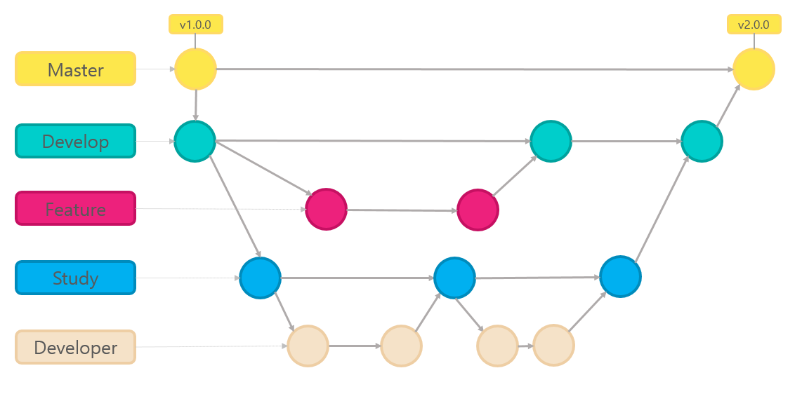
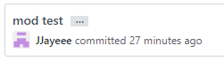
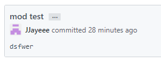

### 코드 관리: Gitlab

#### 1. Git-flow



- master 
- develop
- feature  
  - 개별 기능 구현
  - ex) `feature/dataset/path`
- study
  - Sub02 프로젝트 특성 상 개인적으로 공부한 내용들을 관리하기 위해 만든 developer의 상위 branch
- developer
  - doc 폴더를 통해서 개인 공부 자료, 미팅 자료 및 파일 등을 관리
  - ex) `sumin`, `soulG/conf`


#### 2. Commit Message

1. Convention

   - message 

     - 자주 쓰는 기본 메시지의 경우
       - Mod : modify, 코드 수정 시
       - Add  : 새 파일 작성
       - Del : delete, 코드 및 파일 삭제
     - 기타
       - Refactor : 전면 수정
       - Resolve, Reset, Update 등등

   - title & body

     -  `...` 로 요약 된 커밋 메시지를 통해 titie 과 detail 을 구분하기
  - 커밋 메시지 기록 중 shift enter 키를 누르고 detail 을 입력합니다.
   
     
   
     
   
  ```
     $ commit -m 'message file.exe title
  [shift enter]
     > detail message (여기는 한글 or 영어)'
     ```
   
   - 이슈와 매칭하는 경우 하단에 기록
   
     ```
     fix file.exe title
  
     see the issue for details
     
     Refs #133
     ```
   
     


### 일정 및 이슈 관리: Jira
#### 1. 프로젝트 일정

|      | Sub2 PRJ 스프린트 #2                                         | Sub2 PRJ 스프린트 #3                                         |
| ---- | ------------------------------------------------------------ | ------------------------------------------------------------ |
| Date | 30/3월/20 9:30 오전 - 03/4월/20 2:00 오후                    | 06/4월/20 9:30 오전 - 10/4월/20 2:00 오후                    |
| Goal | 명세서의 기능을 구현하면서 Sub03에서 활용할 기술을 익히고 프로젝트 주제를 선정합니다. | 명세서의 기능을 모두 구현하고 Sub3 계획 단계를 마무리합니다. |


#### 2. 프로젝트 규칙

- 매일 아침 9시 반 미팅 이후 팀 미팅
- 매일 저녁 4시 반 미팅 이후 팀 미팅
- MR 시에 코드 리뷰 해주기
  - 리퀘스트 보낸 사람은 MR 이후 merge 된 branch 삭제 하기
  - 리퀘스트 받은 사람은 MR 이후 pull 해주기
- 공지 채널에 올라오는 공지 글에는 읽었다는 확인 스티커를 달아주기
- 사소한 것은 없으니 늘 적극적으로 줌 참여해주기


