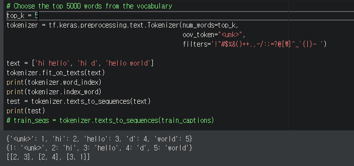
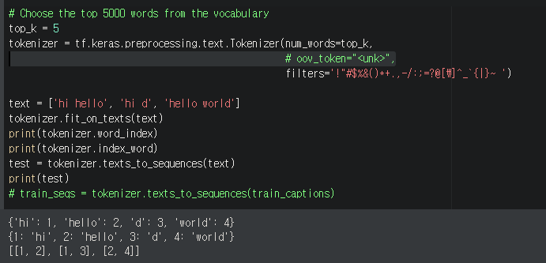
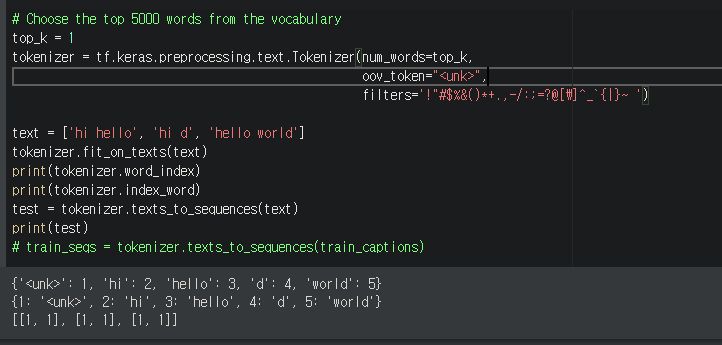
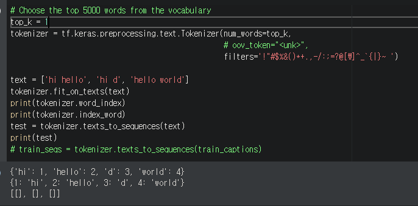

## 텍스트 데이터 전처리

### 1. 텍스트 데이터 토큰화

#### 1. 목표

1. 텍스트 상태인 데이터를 Tensorflow Tokenizer 를 이용해 각 단어에 해당하는 고유 숫자로 변환(정수 인코딩) 한다.
2. 캡선의 시작과 끝을 표현하기 위해 <start>, <end> 토큰을 추가한다.
3. 학습에 용이하도록 모든 캡션의 길이를 맞춰주기 위해 <pad> 토큰을 사용한다.
4. tokenizer 를 저장하고 불러올 수 있는 함수를 구현한다. 파일은 python pickle로 저장한다


#### 2. 개념 정리

1. 텍스트 데이터를 다루는 단계 (https://subinium.github.io/Keras-6-1/)

   컴퓨터는 텍스트를 이해하는 것이 아닌 통계적 구조를 통해 문제를 해결합니다. 패턴을 인식하는 것입니다. 이를 위해 모든 신경망과 마찬가지로 전처리를 통해 입력할 수 있는 데이터 형태로 만들어야 합니다.

   텍스트를 수치형 텐서로 변환하는 과정을 **텍스트 벡터화(vectorizing text)** 라고 합니다. 이는 다음과 같은 방법들이 있습니다.

   - 텍스트를 단어로 나누고 각 단어를 하나의 벡터(고유한 정수)로 변환(mapping)합니다.
   - 텍스트를 문자로 나누고 각 문자를 하나의 벡터로 변환합니다.
   - 텍스트에서 단어나 문자의 n-gram 을 추출하여 각 n-그램을 하나의 벡터로 변환합니다. n-gram은 연속된 단어나 문자의 그룹으로 텍스트에서 단어나 문자를 하나씩 이동하면서 추출합니다.

   텍스트를 나누는 이런 단위를 **토큰(token)** 이라고 합니다. 그리고 텍스트를 토큰으로 나누는 것을 **토큰화(tokenization)** 라고 합니다. 텍스트 데이터는 이런 토큰화를 적용하고, 수치형 벡터에 연결하는 작업이 필요합니다. 예로는 아래 두 가지 방법이 있습니다.

   1. **원-핫 인코딩(one-hot encoding)**
   2. 토큰 임베딩(token embedding) 또는 단어 임베딩(word embedding)

   

2. 정수 인코딩 (https://wikidocs.net/31766)

   자연어 처리에서는 텍스트를 숫자로 바꾸는 여러가지 기법들이 있습니다. 그리고 그러한 기법들을 본격적으로 적용시키기 위한 첫 단계로 `각 단어를 고유한 정수에 맵핑(mapping)시키는 전처리 작업`이 필요할 때가 있습니다.

   예를 들어 갖고 있는 텍스트에 단어가 5,000개가 있다면, 5,000개의 단어들 각각에 1번부터 5,000번까지 단어와 맵핑되는 고유한 정수, 다른 표현으로는 인덱스를 부여합니다. 가령, book은 150번, dog는 171번, love는 192번, books는 212번과 같이 숫자가 부여됩니다. 

   인덱스를 부여하는 방법은 여러 가지가 있을 수 있는데 랜덤으로 부여하기도 하지만, 보통은 전처리 또는 빈도수가 높은 단어들만 사용하기 위해서 단어에 대한 빈도수를 기준으로 정렬한 뒤에 부여합니다.

   단어에 정수를 부여하는 방법 중 하나로 단어를 빈도수 순으로 정렬한 단어 집합(vocabulary)을 만들고, 빈도수가 높은 순서대로 차례로 낮은 숫자부터 정수를 부여하는 방법이 있습니다. 

   케라스(Keras)는 기본적인 전처리를 위한 도구들을 제공합니다. 정수 인코딩을 위해서 케라스의 전처리 도구인 토크나이저를 사용하기도합니다.


#### 3. 구현

- 코드 참고: 'Image captioning with visual attention' https://www.tensorflow.org/tutorials/text/image_captioning
  - Preprocess and tokenize the captions
    - First, you'll tokenize the captions (for example, by splitting on spaces). 
          This gives us a vocabulary of all of the unique words in the data (for example, "surfing", "football", and so on).
    - Next, you'll limit the vocabulary size to the top 5,000 words (to save memory). 
          You'll replace all other words with the token "UNK" (unknown).
    - You then create word-to-index and index-to-word mappings.
    - Finally, you pad all sequences to be the same length as the longest one.


#### 1. Tokenizer 만들기

1. tokenizer 를 만들 captions 데이터를 불러옵니다.

   ```python
   import numpy as np
   import tensorflow as tf
   
   dataset_path = '../../../datasets/captions.csv'
   data = np.loadtxt(dataset_path, delimiter='|', dtype=np.str)
   captions = data[1:, 2:]
   print(captions.shape) # (158915, 1)
   print(captions.ndim) # 2
   print(captions[:2, :])
   ```

   ```bash
   [[' Two young guys with shaggy hair look at their hands while hanging out in the yard .']
    [' Two young , White males are outside near many bushes .']]
   ```

   
   
2. 주어진 data 를 tokenizer에서 처리하려면 1차원으로 만들어주어야 합니다.

   ```python
   train_captions = np.squeeze(captions, axis=1)
   print(captions.shape) # (158915,)
   print(captions.ndim) # 1
   ```

   
   
3. 캡션의 시작과 끝을 표현하기 위해 <start>, <end> 토큰을 추가해줍니다.

   ```python
   train_captions = ['<start>' + cap + ' <end>' for cap in captions]
   print(captions[:2])
   ```

   ```bash
   ['<start> Two young guys with shaggy hair look at their hands while hanging out in the yard . <end>'
    '<start> Two young , White males are outside near many bushes . <end>']
   ```

   
   
4. 빈도 순으로 정렬한 단어 집합 (Vocabulary) 만들기

   - num_words :  빈도수가 높은 상위 몇 개의 단어만 사용하겠다고 지정하는 값 (+1 : padding 을 제외하고 top_k 값이 되도록 하기 위해)
     - num_words 를 지정하는 것 과 index_word 와 word_index 는 상관 없다. [여기](#num_words)
- oov : keras tokenizer 는 기본적으로 단어 집합에 없는 단어인 OOV에 대해서, 단어를 정수로 바꾸는 과정에서 아예 단어를 제거한다는 특징이 있습니다. 단어 집합에 없는 단어들은 OOV로 간주하여 보존하고 싶다면 tokenizer의 인자 oov_token을 사용합니다.
  
   ```python
   top_k = 5000
   tokenizer = tf.keras.preprocessing.text.Tokenizer(num_words=top_k + 1,
                                                     oov_token="<unk>", lower=True,
                                                     split=' ',
                                                     filters='!"#$%&()*+.,-/:;=?@[\]^_`{|}~ ')
   ```
```
   
   
   
5. `fit_on_texts` 빈도수를 기준으로 단어 집합을 생성합니다.

   ```python
   tokenizer.fit_on_texts(captions)
   print(tokenizer.word_index)  # 각 단어에 인덱스가 어떻게 부여되었는가 확인
   print('%s개의 고유한 토큰을 찾았습니다.' % len(tokenizer.word_index))
   print(tokenizer.word_counts)  # 각 단어가 카운트를 수행하였을 때 몇 개였는가 확인
```

   ```bash
   {'<unk>': 1, 'a': 2, 'in': 3, 'on': 4, 'the': 5, 'of': 6, 'man': 7, 'with': 8,}
   18316개의 고유한 토큰을 찾았습니다.
   OrderedDict([('two', 20), ('young', 10), ('guys', 4), ('with', 23), ('hair', 2),])
   ```

   

6.  학습에 용이하도록 모든 캡션의 길이를 맞춰주기 위해 <pad> 토큰을 만들어줍니다.

   ```python
   tokenizer.word_index['<pad>'] = 0
   tokenizer.index_word[0] = '<pad>'
   ```
   
   

7. tokenizer 저장하기

   ```python
   # pickle 파일로 저장하기
   with open('./tokenizer.pickle', 'wb') as f:
       pickle.dump(tokenizer, f, protocol=pickle.HIGHEST_PROTOCOL)
   
   # JSON file 로 저장하기
   tokenizer_json = tokenizer.to_json()
   with open('./tokenizer.json', 'w', encoding='utf-8') as f:
       f.write(json.dumps(tokenizer_json, ensure_ascii=False))
   ```


8. tokenizer 불러오기

   ```python
   with open('../../../datasets/tokenizer.pickle', 'rb') as f:
   	tokenizer = pickle.load(f)
   ```

   


#### 2. Tokenizer 적용하기

1. `texts_to_sequences`각 단어를 이미 정해진 벡터로 변환합니다.

   ```python
   train_seqs = tokenizer.texts_to_sequences(captions)
   print(train_seqs[:2])
   ```

   ```bash
   [[3, 14, 23, 328, 12, 2040, 90, 189, 18, 64, 161, 25, 326, 73, 5, 6, 492, 4], [3, 14, 23, 22, 712, 15, 56, 81, 196, 1429, 4],]
   ```

   

2. <pad> 토큰으로 각 캡션의 길이를 동일하게 만듭니다.

   ```python
   # Pad each vector to the max_length of the captions
   # If you do not provide a max_length value, pad_sequences calculates it automatically
   # padding: String, 'pre' or 'post': pad either before or after each sequence.
   
   cap_vector = tf.keras.preprocessing.sequence.pad_sequences(train_seqs, padding='post')
   print(cap_train[:2])
   ```

   ```bash
   [[   3   14   23  328   12 2040   90  189   18   64  161   25  326   73
        5    6  492    4    0    0    0    0    0    0    0    0    0    0
        0    0    0    0    0    0    0    0    0    0    0    0    0    0
        0    0    0    0    0    0    0    0    0    0    0    0    0    0
        0    0    0    0    0    0    0    0    0    0    0    0    0    0
        0    0    0    0    0    0    0    0    0]
    [   3   14   23   22  712   15   56   81  196 1429    4    0    0    0
        0    0    0    0    0    0    0    0    0    0    0    0    0    0
        0    0    0    0    0    0    0    0    0    0    0    0    0    0
        0    0    0    0    0    0    0    0    0    0    0    0    0    0
        0    0    0    0    0    0    0    0    0    0    0    0    0    0
        0    0    0    0    0    0    0    0    0]]
   ```


#### 3. Code

```python
import numpy as np
import tensorflow as tf
import pickle
import json

dataset_path = '../../../datasets/captions.csv'
data = np.loadtxt(dataset_path, delimiter='|', dtype=np.str)
captions = data[1:, 2:]

captions = np.squeeze(captions, axis=1)
captions = ['<start>' + cap + ' <end>' for cap in captions]

top_k = 5000
tokenizer = tf.keras.preprocessing.text.Tokenizer(num_words=top_k + 1,
                                                  oov_token="<unk>", lower=True,
                                                  split=' ',
                                                  filters='!"#$%&()*+.,-/:;=?@[\]^_`{|}~ ')

tokenizer.fit_on_texts(captions) 
tokenizer.word_index['<pad>'] = 0
tokenizer.index_word[0] = '<pad>'

train_seqs = tokenizer.texts_to_sequences(captions) 

cap_vector = tf.keras.preprocessing.sequence.pad_sequences(train_seqs, padding='post')


with open('./tokenizer.pickle', 'wb') as f:
    pickle.dump(tokenizer, f, protocol=pickle.HIGHEST_PROTOCOL)

tokenizer_json = tokenizer.to_json()
with open('./tokenizer.json', 'w', encoding='utf-8') as f:
    f.write(json.dumps(tokenizer_json, ensure_ascii=False))
    
with open('tokenizer.pickle', 'rb') as f:
    h = pickle.load(f)
```


-----

### num_words

https://github.com/keras-team/keras/issues/8092














