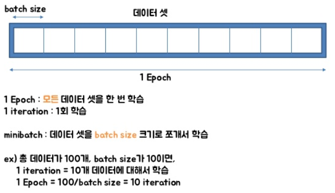

```
    np.savetxt(
        './datasets/train_datasets.csv', train_dataset, fmt='%s', delimiter='|'
    )
    np.save('./datasets/train_datasets.npy', train_dataset)
```

```
    data = np.loadtxt(dataset_path, delimiter='|', dtype=np.str)
    data = np.load(dataset_path)
```


- 텐서플로 [수학 연산](https://www.tensorflow.org/api_guides/python/math_ops)은 파이썬 객체와 NumPy 배열을 [`tf.Tensor`](https://www.tensorflow.org/api_docs/python/tf/Tensor) 객체로 변환합니다. `tf.Tensor.numpy` 메서드는 객체 값을 NumPy `ndarray`로 반환합니다.
- https://www.tensorflow.org/guide/eager


# epoch, batch size & iteration

- https://m.blog.naver.com/PostView.nhn?blogId=qbxlvnf11&logNo=221449297033&proxyReferer=https%3A%2F%2Fwww.google.com%2F

- 알고리즘이 iterative 하다 : 결과를 내기 위해 여러 번의 최적화 과정을 거쳐야 하는 알고리즘이다
- 다루어야 할 데이터가 많고, 메모리가 부족하기도 하고, 한 번의 계산으로는 최적화 된 값을 찾기가 어려움
  - 머신러닝에서 최적화를 할 때는 일반적으로 여러 번 학습 과정을 거친다.
  - 한 번의 학습 과정에서 사용하는 데이터를 나누는 방식으로 세분화 시킨다.

- epoch
  - One Epoch is when an ENTIRE dataset is passed forward and backward through the neural network only ONCE (즉, 전체 데이터 셋에 대해 한 번 학습을 완료한 상태)
  - 신경망에서 사용되는 역전파 알고리즘(backpropagation algorithm)은 파라미터를 사용하여 입력부터 출력까지의 각 계층의 weight를 계산하는 과정을 거치는 순방향 패스(forward pass), forward pass를 반대로 거슬러 올라가며 다시 한 번 계산 과정을 거처 기존의 weight를 수정하는 역방향 패스(backward pass)로 나뉜다. 이 전체 데이터 셋에 대해 해당 과정(forward pass + backward pass)이 완료되면 한 번의 epoch가 진행됐다고 볼 수 있다.
  - 모델을 만들 때 적절한 epoch 값을 설정해야만 underfitting과 overfitting을 방지할 수 있다. epoch 값이 너무 작다면 underfitting이 발생, 너무 크다면 overfitting이 발생할 확률이 높다.
- 메모리의 한계와 속도 저하 때문에 대부분의 경우에는 한 번의 epoch에서 모든 데이터를 한꺼번에 집어넣을 수는 없다. 그래서 데이터를 나누어서 주게 되는데 이때 몇 번 나누어서 주는가를 iteration, 각 iteration마다 주는 데이터 사이즈를 batch size라고 한다.

- batch size
  - Total number of training examples present in a single batch.
  - batch size는 한 번의 batch마다 주는 데이터 샘플의 size. 여기서 batch(보통 mini-batch라고 표현)는 나눠진 데이터 셋을 뜻한다.

- iteration
  - The number of passes to complete one epoch.
  - epoch를 나누어서 실행하는 횟수




[^출처]: https://www.slideshare.net/w0ong/ss-82372826


전체 2000 개의 데이터가 있고, epochs = 20, batch_size = 500이라면

1 epoch는 각 데이터의 size가 500인 batch가 들어간 네 번의 iteration으로 나누어 진다.

그리고 전체 데이터셋에 대해서는 20 번의 학습이 이루어졌으며, iteration 기준으로 보자면 총 80 번의 학습이 이루어진 것


# RNN 을 사용한 텍스트 생성

- https://www.tensorflow.org/tutorials/text/text_generation


- ```python
  # 배치 크기
  BATCH_SIZE = 64
  
  # 데이터셋을 섞을 버퍼 크기
  # (TF 데이터는 무한한 시퀀스와 함께 작동이 가능하도록 설계되었으며,
  # 따라서 전체 시퀀스를 메모리에 섞지 않습니다. 대신에,
  # 요소를 섞는 버퍼를 유지합니다).
  BUFFER_SIZE = 10000
  ```


- 자연어(NL, Natural Language)나 음성신호, 주식과 같은 연속적인(sequential) **시계열**(time series) 데이터에 적합한 모델 https://excelsior-cjh.tistory.com/183?category=940400 

- corpus 자연어 처리의 경우, 자연어 데이터를 **말뭉치 또는 코퍼스(corpus)**라고 부르는데 코퍼스의 의미를 풀이하면, 조사나 연구 목적에 의해서 특정 도메인으로부터 수집된 텍스트 집합을 말합니다.


