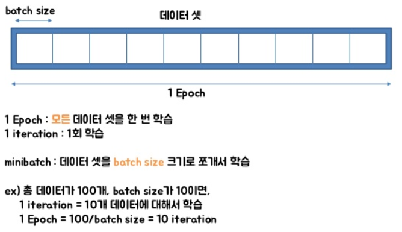

# Numpy


```
    np.savetxt(
        './datasets/train_datasets.csv', train_dataset, fmt='%s', delimiter='|'
    )
    np.save('./datasets/train_datasets.npy', train_dataset)
```

```
    data = np.loadtxt(dataset_path, delimiter='|', dtype=np.str)
    data = np.load(dataset_path)
```


- 텐서플로 [수학 연산](https://www.tensorflow.org/api_guides/python/math_ops)은 파이썬 객체와 NumPy 배열을 [`tf.Tensor`](https://www.tensorflow.org/api_docs/python/tf/Tensor) 객체로 변환합니다. `tf.Tensor.numpy` 메서드는 객체 값을 NumPy `ndarray`로 반환합니다.
- https://www.tensorflow.org/guide/eager


# epoch, batch size & iteration

- https://m.blog.naver.com/PostView.nhn?blogId=qbxlvnf11&logNo=221449297033&proxyReferer=https%3A%2F%2Fwww.google.com%2F

- 알고리즘이 iterative 하다 : 결과를 내기 위해 여러 번의 최적화 과정을 거쳐야 하는 알고리즘이다
- 다루어야 할 데이터가 많고, 메모리가 부족하기도 하고, 한 번의 계산으로는 최적화 된 값을 찾기가 어려움
  - 머신러닝에서 최적화를 할 때는 일반적으로 여러 번 학습 과정을 거친다.
  - 한 번의 학습 과정에서 사용하는 데이터를 나누는 방식으로 세분화 시킨다.

- epoch
  - One Epoch is when an ENTIRE dataset is passed forward and backward through the neural network only ONCE (즉, 전체 데이터 셋에 대해 한 번 학습을 완료한 상태)
  - 신경망에서 사용되는 역전파 알고리즘(backpropagation algorithm)은 파라미터를 사용하여 입력부터 출력까지의 각 계층의 weight를 계산하는 과정을 거치는 순방향 패스(forward pass), forward pass를 반대로 거슬러 올라가며 다시 한 번 계산 과정을 거처 기존의 weight를 수정하는 역방향 패스(backward pass)로 나뉜다. 이 전체 데이터 셋에 대해 해당 과정(forward pass + backward pass)이 완료되면 한 번의 epoch가 진행됐다고 볼 수 있다.
  - 모델을 만들 때 적절한 epoch 값을 설정해야만 underfitting과 overfitting을 방지할 수 있다. epoch 값이 너무 작다면 underfitting이 발생, 너무 크다면 overfitting이 발생할 확률이 높다.
- 메모리의 한계와 속도 저하 때문에 대부분의 경우에는 한 번의 epoch에서 모든 데이터를 한꺼번에 집어넣을 수는 없다. 그래서 데이터를 나누어서 주게 되는데 이때 몇 번 나누어서 주는가를 iteration, 각 iteration마다 주는 데이터 사이즈를 batch size라고 한다.

- batch size
  - Total number of training examples present in a single batch.
  - batch size는 한 번의 batch마다 주는 데이터 샘플의 size. 여기서 batch(보통 mini-batch라고 표현)는 나눠진 데이터 셋을 뜻한다.

- iteration
  - The number of passes to complete one epoch.
  - epoch를 나누어서 실행하는 횟수




[^출처]: https://www.slideshare.net/w0ong/ss-82372826


전체 2000 개의 데이터가 있고, epochs = 20, batch_size = 500이라면

1 epoch는 각 데이터의 size가 500인 batch가 들어간 네 번의 iteration으로 나누어 진다.

그리고 전체 데이터셋에 대해서는 20 번의 학습이 이루어졌으며, iteration 기준으로 보자면 총 80 번의 학습이 이루어진 것


# RNN 

### 1. RNN 이용 텍스트 생성

- https://www.tensorflow.org/tutorials/text/text_generation


- ```python
  # 배치 크기
  BATCH_SIZE = 64
  
  # 데이터셋을 섞을 버퍼 크기
  # (TF 데이터는 무한한 시퀀스와 함께 작동이 가능하도록 설계되었으며,
  # 따라서 전체 시퀀스를 메모리에 섞지 않습니다. 대신에,
  # 요소를 섞는 버퍼를 유지합니다).
  BUFFER_SIZE = 10000
  ```


- 자연어(NL, Natural Language)나 음성신호, 주식과 같은 연속적인(sequential) **시계열**(time series) 데이터에 적합한 모델 https://excelsior-cjh.tistory.com/183?category=940400 

- corpus 자연어 처리의 경우, 자연어 데이터를 **말뭉치 또는 코퍼스(corpus)**라고 부르는데 코퍼스의 의미를 풀이하면, 조사나 연구 목적에 의해서 특정 도메인으로부터 수집된 텍스트 집합을 말합니다.


### 2. 단어 임베딩 사용하기

https://subinium.github.io/Keras-6-1/

단어와 벡터를 연관 하는 강력하고 인기 있는 방법은 **단어 임베딩** 이라는 밀집 **단어 벡터(word vector)** 를 사용하는 것입니다. 원-핫 인코딩으로 만든 벡터는 희소하고 고차원입니다. 하지만 단어 임베딩은 **저차원**의 실수형 벡터입니다.

단어 임베딩은 데이터로부터 학습됩니다. 보통 256, 512, 1024차원의 단어 임베딩을 사용하고, 원-핫 인코딩은 20000차원 또는 그 이상의 벡터인 경우가 많습니다. 즉 단어 임베딩이 더 많은 정보를 적은 자원에 저장합니다. 단어 임베딩을 만드는 방법은 두 가지입니다.

- 관심 대상인 문제와 함께 단어 임베딩을 학습합니다. 이런 경우 랜덤한 단어 벡터로 시작해서 신경망의 가중치를 학습하는 것과 같은 방식으로 단어 벡터를 학습합니다.
- 풀려는 문제가 아니고 다른 머신 러닝 작업에서 미리 계산된 단어 임베딩을 로드합니다. 이를 **사전 훈련된 단어 임베딩(pretrained word embedding)** 이라고 합니다.


#### Embedding 층을 사용하여 단어 임베딩 학습하기

단어와 밀집 벡터를 연관 짓는 가장 간단한 방법은 랜덤하게 벡터를 선택하는 것입니다. 이 방식의 문제점은 임베딩 공간이 구조적이지 않다는 것입니다. 의미 관계가 유사하더라도 완전 다른 임베딩을 가집니다. 그렇기에 단어 사이에 있는 의미 관계를 반영하여 임베딩을 진행해야 합니다.

단어 임베딩은 언어를 기하학적 공간에 매핑하는 것입니다. 일반적으로 두 단어 벡터 사이의 거리(L2 거리)는 이 단어 사이의 의미 거리와 관계되어 있습니다. 거리 외에 임베딩 공간의 특정 방향도 의미를 가질 수 있습니다.

의미있는 기하학적 변환의 예시는 성별, 복수(plural)과 같은 벡터가 있습니다. (‘king’ + ‘female’ => ‘queen’) 단어 임베딩 공간은 전형적으로 이런 해석 가능하고 잠재적으로 유용한 수천 개의 벡터를 특성으로 가집니다.

하지만 사람의 언어를 완벽하게 매핑해서 이상적인 단어 임베딩 공간을 만들기는 어렵습니다. 언어끼리도 종류가 많고 언어는 특정 문화와 환경을 반영하기 때문에 서로 동일하지 않습니다. 그렇기에 각 언어와 상황에 따라 임베딩 공간을 학습하는 것이 타당합니다.

이를 역전파 + 케라스를 이용해서 `Embedding` 층을 학습할 수 있습니다.


```python
# 코드 6-5 Embedding층의 객체 생성하기

from keras.layers import Embedding

# Embedding 층은 적어도 두 개의 매개변수를 받습니다.
# 가능한 토큰의 개수(여기서는 1,000으로 단어 인덱스 최댓값 + 1입니다)와 임베딩 차원(여기서는 64)입니다
# 인덱스는 0을 사용하지 않으므로 단어 인덱스는 1~999사이의 정수입니다
embedding_layer = Embedding(1000, 64)
```


`Embedding` 층을 정수 인덱스를 밀집 벡터로 매핑하는 딕셔너리로 이해하는 것이 좋습니다. 정수를 입력으로 받아 내부 딕셔너리에서 이 정수에 연관된 벡터를 찾아 반환합니다. 딕셔너리 탐색은 효율적으로 수행됩니다. (텐서플로 백엔드에서는 tf.nn.embedding_lookup()함수를 사용하여 병렬 처리)

단어 인덱스 -> Embdding 층 -> 연관된 단어 벡터

`Embedding` 층은 크기가 `(samples, sequences_length)`인 2D 정수 텐서를 입력으로 받습니다. 각 샘플은 정수의 시퀀스입니다. 가변 길이의 경우, 제로패딩 또는 자름으로 크기를 맞춥니다.

`Embedding` 층은 크기가 `(samples, sequences_length, embedding_dimensionality)`인 3D 정수 텐서를 반환합니다. 이런 3D 텐서는 RNN 층이나 1D 합성곱 층에서 처리됩니다.

객체를 생성할 때 가중치는 다른 층과 마찬가지로 랜덤으로 초기화됩니다. 훈련하면서 이 단어 벡터는 역전파를 통해 점차 조정되어 이어지는 모델이 사용할 수 있도록 임베딩 공간을 구성합니다. 훈련이 끝나면 임베딩 공간은 특정 문제에 특화된 구조를 가지게 됩니다.


#### 사전 훈련된 단어 임베딩 사용하기

컨브넷과 마찬가지로 사전 훈련된 단어 임베딩을 사용할 수 있습니다. 데이터가 적을 때 매우 유용합니다. 단어 임베딩은 일반적으로 단어 출현 통계를 사용하여 계산합니다. 신경망을 사용하는 것도 있고 그렇지 않은 방법도 존재합니다. 단어를 위해 밀집된 저차원 임베딩 공간을 비지도 학습 방법으로 계산하는 방법도 연구되고 있습니다.

**Word2Vec** 알고리즘은 성공적인 단어 임베딩 방법으로 성별처럼 구체적인 의미가 있는 속성을 잡아냅니다. 다른 단어 임베딩 데이터베이스로 스탠포드에서 개발한 **GloVe** 가 있습니다. 이 기법은 동시 출현 통계를 기록한 행렬을 분해하는 기법을 사용합니다. 이 개발자들은 위키피디아 데이터와 커먼 크롤 데이터에서 가져온 수백만 개의 영어 토큰에 대해서 임베딩을 계산했습니다. 


### 3. 순환 신경망 이해하기

완전 연결 네트워크나 컨브넷처럼 지금까지 본 모든 신경망의 특징은 메모리가 없다는 것입니다. 네트워크로 주입되는 입력은 개별적으로 처리되며 입력 간에 유지되는 상태가 없습니다. 이런 네트워크로 시계열, 시퀀스 데이터를 처리하려면 전체 시퀀스를 주입해야합니다. 이런 네트워크를 **피드포워드 네트워크(feedforward network)** 라고 합니다.

하지만 실제 문장을 읽는 것처럼 이전에 나온 데이터를 사용하며 내부 모델을 계속 유지하며 업데이트할 수도 있습니다. 극단적으로 단순화시킨 버전이지만 **순환 신경망(Recurrent Neural Network, RNN)** 은 같은 원리를 적용한 것입니다. 시퀀스의 원소를 순회하면서 지금까지 처리한 정보를 **상태(state)** 에 저장합니다.

순환 신경망은 내부에 루프가 있는 신경망의 한 종류입니다. 하나의 시퀀스가 하나의 데이터 포인터로 간주됩니다. 이 네트워크는 시퀀스의 원소를 차례대로 방문합니다.


#### LSTM과 GRU 층 이해하기

 SimpleRNN이 텍스트 시퀀스에 적합하지 않습니다. 케라스에는 SimpleRNN 외에 다른 순환 층도 있습니다. LSTM과 GRU 2개입니다. 실전에서는 항상 둘 중 하나를 사용합니다. SimpleRNN은 실전에 쓰기에는 너무 단순하기 때문입니다.

SimpleRNN은 이론적으로 시간 t에서 이전의 모든 타임스텝의 정보를 유지할 수 있습니다. 실제로는 긴 시간에 걸친 의존성은 학습할 수 없는 것이 문제입니다. 층이 많은 일반 네트워크에서 나타나는 것과 비슷한 현상인 **그래디언트 소실 문제(vanishing gradient problem)** 때문입니다.

이런 문제를 해결하기 위해 고안된 것이 LSTM과 GRU 층입니다. 그 중 LSTM을 살펴봅시다. LSTM은 Long Short-Term Memory의 약자입니다. 이 알고리즘은 위의 문제를 해결하기 위해 만들어졌습니다. 우선 이 층은 SimpleRNN의 변종입니다. 정보를 여러 타임스텝에 걸쳐 나르는 방법이 추가됩니다.


ct라는 cell state가 추가되고, xt가 input, ht가 output입니다.

cell state는 타입스텝을 가로지르는 정보를 나르는 데이터 흐름입니다. 입력 연결과 순환 연결로부터 이 정보가 합성됩니다. 그러고는 다음 타임스텝으로 전달될 상태를 변경시킵니다. 이 흐름이 다음 출려과 상태를 조정하는 것입니다.

이제 여기서 가질 수 있는 의문은 ctct에서 ct+1ct+1으로 넘어가는 방식입니다. 여기에는 총 3가지 변환이 관련되어 있습니다. 3개 모두 SimpleRNN과 같은 형태를 가집니다. 3개의 변환을 각각 i, f, t로 표시하겠습니다.

```
# 코드 6-25 LSTM 구조의 의사코드 (1/2)
output_t = asctivation(c_t) * activation(dot(input_t,Wo) + dot(state_tm Uo) + bo)

i_t = activation(dot(state_t, Ui) + dot(input_t, Wi) + bi)
f_t = activation(dot(state_t, Uf) + dot(input_t, Wf) + bf)
k_t = activation(dot(state_t, Uk) + dot(input_t, Wk) + bk)
```

이제 이를 이용해서 ct+1ct+1 를 구합니다.

```
# 코드 6-26 LSTM 구조의 의사코드 (2/2)

c_t+1 = i_t * k_t + c_t * f_t
```

이 연산들이 하는 일을 해석하면 다음과 같은 통찰을 얻을 수 있습니다.

- c_t와 f_t의 곱셈은 이동을 위한 데이터 흐름에서 관련이 적은 정보를 의도적으로 삭제
- i_t와 k_t는 현재에 대한 정보를 제공하고 이동 트랙을 새로운 정보로 업데이트

하지만 결국은 가중치 행렬에 따라 값들이 변경됩니다. 가중치 행렬은 엔드-투-엔드 방식으로 학습됩니다. 이 과정은 훈련 반복마다 새로 시작되며 이런저런 연산들에 목적을 부여하기가 불가능 합니다. LSTM셀의 구체적인 구조에 대해 이해하기 보다는 역할을 기억하라고 합니다. 이 부분은 후에 더 구체적으로 공부해보면서 맞는 말인지 점검해봐야겠습니다.

많은 계산을 사용한 것치고는 좋은 결과는 아닙니다. 그 이유는 임베딩 차원이나 LSTM 출력 차원 같은 하이퍼파라미터를 전혀 튜닝하지 않았고 규제가 없었습니다.


# 딥 러닝의 학습 방법

- 인공 신경망이 순전파 과정을 진행하여 예측값과 실제값의 오차를 계산하고 역전파 과정에서 경사 하강법을 사용하여 가중치를 업데이트


## **1. 인공 신경망의 이해(Neural Network Overview)**

우선 예제를 위해 사용될 인공 신경망을 소개합니다. 역전파의 이해를 위해서 여기서 사용할 인공 신경망은 입력층, 은닉층, 출력층 이렇게 3개의 층을 가집니다. 또한 해당 인공 신경망은 두 개의 입력과, 두 개의 은닉층 뉴런, 두 개의 출력층 뉴런을 사용합니다. 은닉층과 출력층의 모든 뉴런은 활성화 함수로 시그모이드 함수를 사용합니다.


# Keras 

Embedding, Modeling, etc. https://wikidocs.net/32105

#### 2. embedding()

Embedding()은 (number of samples, input_length)인 2D 정수 텐서를 입력받습니다. 이 때 각 sample은 정수 인코딩이 된 결과로, 정수의 시퀀스입니다. Embedding()은 워드 임베딩 작업을 수행하고 (number of samples, input_length, embedding word dimentionality)인 3D 텐서를 리턴합니다.

아래의 코드는 실제 동작되는 코드가 아니라 의사 코드(pseudo-code)로 임베딩의 개념 이해를 돕기 위해서 작성되었습니다.

```
# 문장 토큰화와 단어 토큰화
text=[['Hope', 'to', 'see', 'you', 'soon'],['Nice', 'to', 'see', 'you', 'again']]

# 각 단어에 대한 정수 인코딩
text=[[0, 1, 2, 3, 4],[5, 1, 2, 3, 6]]

# 위 데이터가 아래의 임베딩 층의 입력이 된다.
Embedding(7, 2, input_length=5)
# 7은 단어의 개수. 즉, 단어 집합(vocabulary)의 크기이다.
# 2는 임베딩한 후의 벡터의 크기이다.
# 5는 각 입력 시퀀스의 길이. 즉, input_length이다.

# 각 정수는 아래의 테이블의 인덱스로 사용되며 Embeddig()은 각 단어에 대해 임베딩 벡터를 리턴한다.
+------------+------------+
|   index    | embedding  |
+------------+------------+
|     0      | [1.2, 3.1] |
|     1      | [0.1, 4.2] |
|     2      | [1.0, 3.1] |
|     3      | [0.3, 2.1] |
|     4      | [2.2, 1.4] |
|     5      | [0.7, 1.7] |
|     6      | [4.1, 2.0] |
+------------+------------+
# 위의 표는 임베딩 벡터가 된 결과를 예로서 정리한 것이고 Embedding()의 출력인 3D 텐서를 보여주는 것이 아님.
```

Embedding()에 넣어야하는 대표적인 인자는 다음과 같습니다.

**첫번째 인자** = 단어 집합의 크기. 즉, 총 단어의 개수
**두번째 인자** = 임베딩 벡터의 출력 차원. 결과로서 나오는 임베딩 벡터의 크기
**input_length** = 입력 시퀀스의 길이


#### **4. 컴파일(Compile)과 훈련(Training)**

**validation_data(x_val, y_val)** = 검증 데이터(validation data)를 사용합니다. 검증 데이터를 사용하면 각 에포크마다 검증 데이터의 정확도도 함께 출력되는데, 이 정확도는 훈련이 잘 되고 있는지를 보여줄 뿐이며 실제로 모델이 검증 데이터를 학습하지는 않습니다. 검증 데이터의 loss가 낮아지다가 높아지기 시작하면 이는 과적합(overfitting)의 신호입니다.